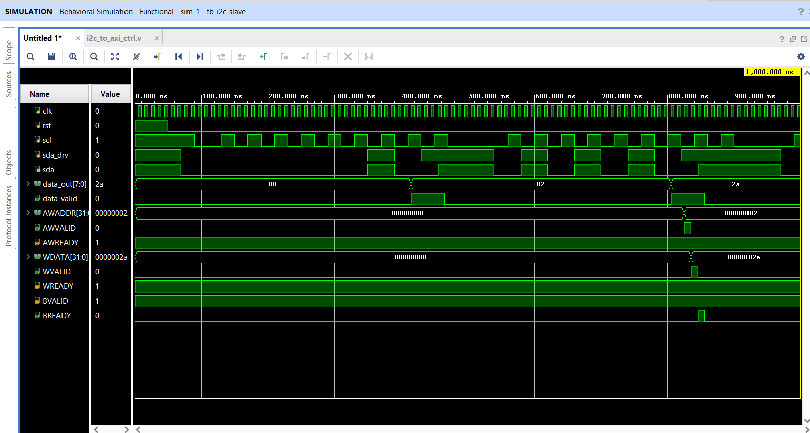

# 🔥 I2C to AXI4-Lite Protocol Converter

## 📌 Overview
This project implements a **hardware protocol converter** that translates **I2C transactions** into **AXI4-Lite write operations** and stores the data into an internal memory.

It demonstrates real-world **SoC communication bridging** using Verilog and Vivado.

---

## 🧩 System Architecture
I2C Master → I2C Slave → FSM Controller → AXI4-Lite Master → Memory

---

## 🚀 Features
- ✅ I2C Slave implementation (SCL, SDA)
- ✅ Serial-to-parallel data conversion using shift register
- ✅ FSM-based control logic
- ✅ AXI4-Lite Master (Write channel)
- ✅ VALID/READY handshake protocol
- ✅ Memory / Register file integration
- ✅ End-to-end data flow verification

---

## 🧠 Working Principle

1. **I2C Master** sends data serially (bit-by-bit)
2. **I2C Slave** collects bits and forms 8-bit data (byte)
3. **FSM Controller** interprets:
   - First byte → Address
   - Second byte → Data
4. **AXI4-Lite Master** generates:
   - `AWADDR` → Address
   - `WDATA` → Data
5. **Memory Module** stores the value: memory[address] = data

   
---

## 📊 Example :
Input (I2C):
02 → 2A

AXI Transaction:
AWADDR = 0x02
WDATA = 0x2A

Memory Output:
memory[2] = 2A

---

## 🔄 AXI4-Lite Write Flow
AWVALID → Address handshake
WVALID → Data handshake
BREADY → Response handshake

✔ Transfer occurs only when **VALID & READY = 1**

---

## 📁 Project Structure
I2C-to-AXI4Lite-converter/
- src/
  - i2c_slave.v
  - i2c_to_axi_ctrl.v
  - axi_memory.v
  - top_i2c_axi.v

- tb/
  - tb_i2c_slave.v

- waveforms/
  - simulation_result.png

- README.md

---

## 📸 Simulation Result

---

## 🛠️ Tools & Technologies
- Verilog HDL
- Xilinx Vivado
- Behavioral Simulation

---

## 🎯 Key Learnings
- I2C protocol fundamentals (START, STOP, bit transfer)
- AXI4-Lite protocol (VALID/READY handshake)
- FSM (Finite State Machine) design
- Protocol conversion techniques
- Debugging using waveform analysis

---

## 🚀 Future Improvements
- 🔹 AXI Read Channel implementation
- 🔹 Bidirectional I2C communication (read-back support)
- 🔹 Interrupt-based signaling
- 🔹 Multi-byte / burst transfer support

---

## 👨‍💻 Author
**Abhiram Sahoo**

---

## ⭐ If you found this useful, consider giving a star!
